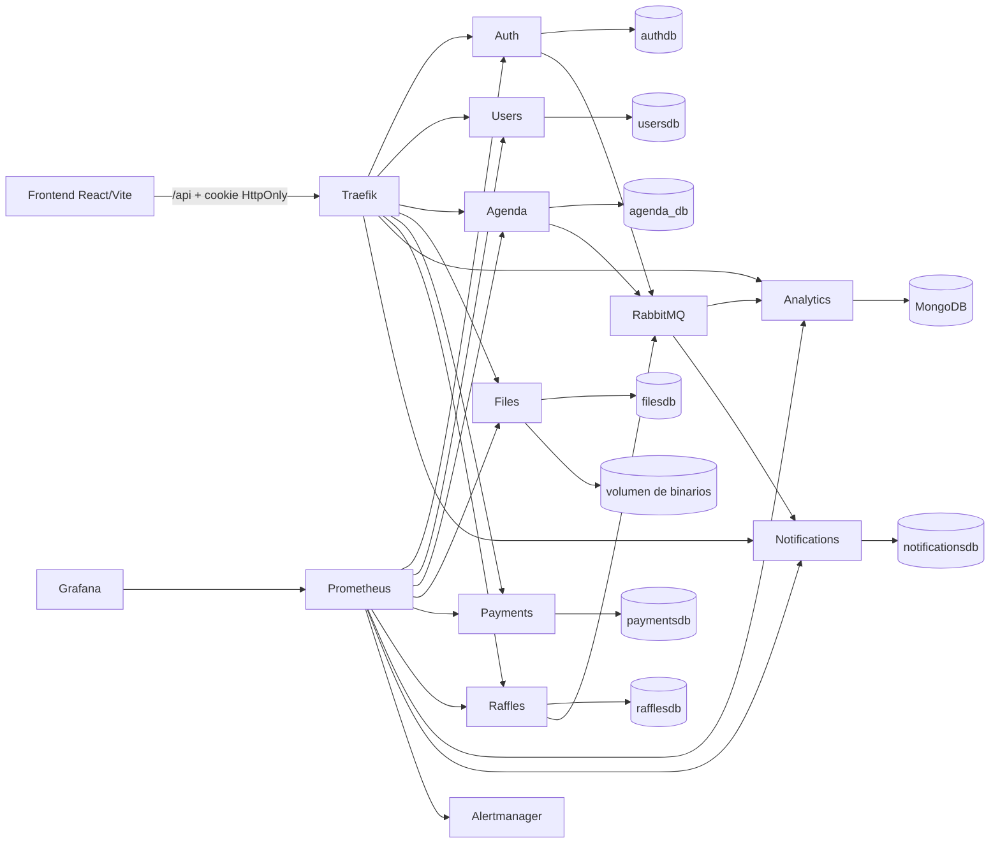

# Integración `proyectoProduccion` → `CONIITI`: implementación final

## 1. Estado y alcance

Este documento registra la implementación realizada sobre `CONIITI`. Sustituye el plan previo que describía componentes “propuestos” o “futuros”: todas las fases quedaron incorporadas al repositorio principal.

- Repositorio canónico: `CONIITI/`.
- Repositorio fuente: `proyectoProduccion/`, usado únicamente como referencia funcional y visual.
- Entrega autocontenida: `CONIITI/` no importa código, assets ni rutas de ejecución desde `proyectoProduccion/`.
- Fecha de cierre de implementación: 21 de agosto de 2026.
- Se conservó React/Vite, FastAPI, PostgreSQL por dominio, MongoDB, RabbitMQ, Traefik, Prometheus y Grafana.
- No se migraron Express, Supabase, autenticación en `localStorage`, roles fuente, datos simulados ni el `Admin.tsx` monolítico.
- La implementación en código está completa; el despliegue de producción todavía debe inyectar secretos, credenciales OAuth/SMTP/pagos, contenido multimedia real y el receiver operativo de Alertmanager.

| Fase original | Resultado |
| --- | --- |
| 0. Baseline, contratos y migraciones | Implementada |
| 1. Multimedia y galería | Implementada |
| 2. Personalización global | Implementada |
| 3. Usuarios, comité y grupos | Implementada |
| 4. Sedes, aforos y videos | Implementada |
| 5. Observabilidad y despliegue | Implementada |
| 6. Asistencia y sorteos | Implementada |

## 2. Decisiones resueltas

1. **Grupo** significa una agrupación real de participantes. Users administra grupos, membresías, auditoría y el permiso `group_admin` acotado a cada grupo; no es un rol global del JWT.
2. **Agenda** es la única fuente de edición, fechas, días válidos y zona horaria. Files no conserva una segunda edición ni una fecha libre.
3. **Files** almacena imágenes, videos y documentos en su volumen y todos sus metadatos en PostgreSQL `filesdb`.
4. **Video** se aloja por defecto en Files. Agenda rechaza URLs multimedia externas salvo hosts incluidos explícitamente en `AGENDA_MEDIA_ALLOWED_HOSTS`.
5. **Perfil progresivo**: el alta local, Google o Microsoft crea la identidad base; carrera, género, documento y código institucional se completan después desde el perfil.
6. **Superusuario** puede administrar todos los dominios integrados. Los administradores de grupo solo actúan sobre membresías autorizadas por backend.
7. **Módulos ocultables**: agenda, conferencistas, comité, autores, galería, memorias, acerca de, contacto y la sección de pagos del inicio.
8. **Módulos no ocultables**: inicio base, autenticación, perfil, estado, seguridad, APIs internas, healthchecks y observabilidad.
9. **Retención de revisiones**: las revisiones de configuración y sus claims de assets se retienen indefinidamente. No existe GC automático; así, cualquier rollback histórico sigue siendo seguro.
10. **Migraciones**: Auth, Users, Agenda, Files y Raffles usan Alembic. Las migraciones y el paso de metadata Files a PostgreSQL están aprobados e incorporados.
11. **Alerting**: Prometheus evalúa reglas y envía a Alertmanager. El repositorio no contiene secretos ni un destino externo; cada entorno conecta el receiver aprobado.

## 3. Arquitectura final y ownership



| Dominio | Dueño autoritativo | Persistencia |
| --- | --- | --- |
| Credenciales, OAuth, OTP, sesión y revocación | Auth | `authdb` |
| Perfil, rol global, comité, grupos y membresías | Users | `usersdb` |
| Edición, calendario, sesiones, sedes, cupos y asistencia | Agenda | `agenda_db` |
| Binarios, catálogo, CMS, configuración y revisiones | Files | `filesdb` + volumen `/app/uploads` |
| Pagos | Payments | `paymentsdb` |
| Snapshot, selección y auditoría de sorteos | Raffles | `rafflesdb` |
| Métricas de negocio | Analytics | MongoDB |
| Trazabilidad de notificaciones | Notifications | `notificationsdb` |

No existen FK físicas entre bases de microservicios. Agenda conserva intención durable y Files expone lookup/claim/release idempotente para impedir el borrado de assets en uso.

## 4. Configuración global, CMS y módulos

Files implementa configuración tipada y común para todos los navegadores:

- `GET /api/files/site-config`: DTO público y ETag.
- `PUT /api/files/site-config`: solo `superuser`, exige `If-Match`; una edición concurrente devuelve `412`.
- `GET /api/files/site-config/revisions`: historial administrativo.
- `POST /api/files/site-config/rollback/{revision}`: publica una revisión nueva a partir de una histórica.

La configuración cubre identidad visual, país invitado, colores validados, assets de marca, copy de páginas y la lista cerrada de módulos ocultables. `EventThemeContext` hidrata la configuración del backend y usa defaults compilados solo cuando Files no está disponible. Las rutas deshabilitadas muestran un estado de módulo no disponible y no se limitan a desaparecer de la navegación.

La edición y las fechas no forman parte de site-config. El frontend las obtiene de `GET /api/agenda/config`; el panel de superusuario las actualiza con ETag mediante `PUT /api/agenda/config`.

## 5. Files, biblioteca y galería

La biblioteca acepta imágenes, videos y documentos con límites independientes, inspección de firma/MIME, checksum y nombre generado. Los videos admiten streaming HTTP `Range`.

- `POST /api/files/upload`
- `GET /api/files/assets` con búsqueda, filtro y paginación
- `GET /api/files/download/{filename}`
- CRUD de `/api/files/documents`
- CRUD de `/api/files/content/cards`
- lookup/claim/release interno de referencias de assets

`AssetPicker` reutiliza el catálogo en CMS, branding y sedes. La galería renderiza imágenes o videos persistidos y ya no presenta contenido de demostración como si fuera vigente cuando falla el backend. Files bloquea el borrado de un asset referenciado por documentos, cards, revisiones o servicios externos.

Los JSON heredados se importan una sola vez de forma idempotente a PostgreSQL; se conservan sin modificaciones para comparación o archivo. La fuente de verdad posterior es `filesdb`.

## 6. Usuarios, perfil, comité y grupos

El modelo de perfil admite `first_name`, `last_name`, institución, carrera, género, documento y código institucional como campos progresivos. El usuario consulta y actualiza su propio perfil en `/api/users/me`.

El superusuario dispone de:

- búsqueda, filtros y paginación en `/api/users/admin/profiles`;
- cambio controlado de rol/estado;
- CRUD del comité autoritativo de Users;
- CRUD de grupos y membresías;
- auditoría de acciones por grupo.

Se impide desactivar o eliminar el último superusuario activo y se evita la autoescalada. Auth incluye `session_version`; una revocación o cambio administrativo invalida la sesión anterior. Los servicios protegidos consultan introspección interna y fallan cerrados si Auth no está disponible.

Un `group_admin` accede desde `/mis-grupos/:groupId/administrar`. Toda lectura o mutación vuelve a comprobar en Users que la membresía esté activa, que pertenezca al grupo y que no se elimine su último administrador.

## 7. Agenda, sedes y videos

Agenda implementa `AgendaConfiguration`, `Venue`, `VenueResource`, relación normalizada sesión-sede y migración compatible desde `salon`.

- `/api/agenda/config`: edición, días y zona horaria.
- `/api/agenda/venues`: listado público y administración de sedes.
- `/api/agenda/venues/{venue_id}/resources`: videos, imágenes, documentos o enlaces ordenados.
- `GET /api/agenda?venue_id=...`: filtro por sede.

Los recursos se muestran bajo demanda, sin autoplay, con controles, poster, captions/transcript y alternativa de enlace. Video, subtítulos WebVTT y transcripción pueden seleccionarse por separado desde Files; cada slot conserva su asset y URL resuelta. El flujo Agenda→Files registra primero una intención durable; el reconciliador usa leases recuperables y ejecuta claims y releases idempotentes. Un recurso no queda público mientras cualquiera de sus claims está pendiente y un release pendiente conserva el bloqueo seguro del asset.

Los cupos se validan dentro de transacción con bloqueo. Agenda rechaza una sesión cuya capacidad supere la sede y evita sobreinscripción concurrente.

## 8. Asistencia autoritativa

La preinscripción no equivale a asistencia. Agenda persiste tokens de verificación y confirmaciones con integridad referencial, revocación e idempotencia.

- `POST /api/agenda/{session_id}/attendance-token`: token corto, firmado, versionado y con JTI; `staff` o `superuser`.
- `POST /api/agenda/{session_id}/attendance/check-in`: confirmación del usuario autenticado.
- `POST /api/agenda/{session_id}/attendance/manual`: alternativa auditada para operadores.
- `GET /api/agenda/{session_id}/attendance` y revocación administrativa.
- `GET /api/agenda/me/attendance`.
- `POST /internal/attendance/eligibility-snapshot`: evidencia mínima para Raffles.

Se comprueban sesión, registro previo configurado, ventana temporal, firma, JTI, versión de clave, límite de usos y revocación. La UI incorpora escaneo QR y alternativa manual accesible.

## 9. Sorteos auditables

`raffles-service` ejecuta el sorteo en backend; el navegador solo presenta el resultado persistido.

1. El superusuario crea el sorteo y fija la regla de elegibilidad.
2. Raffles solicita a Agenda asistencia confirmada y guarda un snapshot inmutable, ordenado y con hash.
3. Users aporta únicamente IDs y nombres mínimos en lotes limitados.
4. El draw usa entropía criptográfica, transacción, lock e `Idempotency-Key`.
5. Se conservan versión de algoritmo, evidencia aleatoria, actor, hash de snapshot y hash de auditoría.
6. El resultado público aparece solo después de la transición explícita a `published` y no expone PII.

Raffles aplica unicidad por ganador, número de extracción e idempotency key. Un evento `premio.adjudicado` se escribe en outbox dentro de la misma transacción del ganador.

## 10. Eventos, flags y rollout

El envelope común incluye `event_id`, `event` y timestamp/campos mínimos del dominio. No se publican documento, género, correo ni otros datos sensibles en eventos de negocio generales.

| Routing key | Productor | Consumidores |
| --- | --- | --- |
| `usuario.registrado` | Auth | Notifications, Analytics |
| `ponencia.creada` | Agenda | Notifications, Analytics |
| `agenda.sesion_actualizada` | Agenda | Notifications, Analytics |
| `asistencia.confirmada` | Agenda | Notifications, Analytics |
| `premio.adjudicado` | Raffles | Notifications, Analytics |

Notifications y Analytics usan colas v2, deduplicación por `event_id`, DLX/DLQ y ACK/NACK explícito. El orden de rollout es:

1. desplegar colas v2, DLQ y consumidores compatibles;
2. ejecutar migraciones;
3. desplegar productores y workers de outbox;
4. habilitar `ASISTENCIA_CONFIRMADA_ENABLED`;
5. habilitar `PREMIO_ADJUDICADO_ENABLED` después de comprobar ambos consumidores.

Los flags controlan el despacho, no la persistencia. Si están deshabilitados, Agenda y Raffles retienen eventos pendientes en PostgreSQL para publicarlos después. `AGENDA_EVENT_OUTBOX_ENABLED` controla el worker de Agenda sin eliminar evidencia durable.

## 11. Despliegue y migraciones

Docker Compose contiene PostgreSQL compartido con bases separadas, MongoDB, RabbitMQ persistente, los ocho microservicios, frontend, Traefik, Prometheus, Alertmanager y Grafana. Los servicios con Alembic esperan dependencias saludables antes de arrancar.

Kubernetes incluye:

- PVC para PostgreSQL, MongoDB, RabbitMQ, uploads, Prometheus, Alertmanager y Grafana;
- ConfigMaps sin secretos y referencias obligatorias a Secrets;
- probes de startup/readiness/liveness;
- Traefik sin dashboard inseguro ni exposición pública de `/metrics`;
- Prometheus, Alertmanager y Grafana como `ClusterIP`.

Auth, Users, Agenda, Files y Raffles ejecutan `alembic upgrade head` al arrancar porque los manifiestos actuales usan una réplica. Antes de escalar, la migración debe moverse a un Job único previo al Deployment.

En una base existente el procedimiento es: backup, verificar/stamp del baseline aplicable, `upgrade head`, smoke test y rollback ensayado sobre una copia. Los scripts de inicialización crean las siete bases cuando el volumen PostgreSQL es nuevo; los scripts locales de Minikube también comprueban y crean idempotentemente cualquier base faltante en un volumen anterior. En clústeres administrados, operación debe aplicar ese mismo control antes del rollout.

## 12. Observabilidad y seguridad operativa

Prometheus scrapea directamente por la red interna los ocho servicios FastAPI. El gateway y nginx niegan `/api/*/metrics`. Compose no publica Prometheus; Grafana solo enlaza `127.0.0.1` y exige `GRAFANA_ADMIN_PASSWORD`. En Kubernetes las credenciales proceden de `grafana-admin-secret`.

El dashboard incluye disponibilidad, RPS, códigos HTTP, CPU, memoria, errores 5xx y latencia; también paneles específicos para configuración, assets, CMS, grupos, perfiles, sedes, asistencia y Raffles.

Las reglas incluidas alertan por:

- servicio no disponible durante dos minutos;
- proporción de 5xx superior al 5 % durante cinco minutos;
- latencia p95 superior a dos segundos durante diez minutos.

Alertmanager agrupa por alerta/servicio y conserva estado y silencios durante 120 horas. `coniiti-operations` es deliberadamente un receiver sin secretos; el canal externo aprobado se monta o genera en el entorno de despliegue.

## 13. Pruebas y comprobaciones de cierre

Las suites incorporadas cubren:

- Auth: OAuth/OTP, sesión versionada, introspección y revocación.
- Users: perfil progresivo, último superusuario, grupos, ámbito, auditoría y concurrencia.
- Files: MIME/tamaño, streaming, búsqueda, referencias, ETag, revisiones, rollback, importación e introspección.
- Agenda: migraciones, configuración, cupos, sedes, claims/reconciliación, tokens, check-in, revocación y snapshot.
- Raffles: snapshot, elegibilidad, concurrencia, idempotencia, evidencia, publicación y outbox.
- Analytics/Notifications/Payments: introspección fail-closed, autorización, deduplicación y contratos de eventos.
- Frontend: agenda, estado, perfil, CMS y servicios integrados.

Resultado de cierre: 123 pruebas backend y 14 pruebas frontend aprobadas (137 en total), lint de frontend y Ruff sin hallazgos, build estricto correcto y `npm audit` con cero vulnerabilidades. Los ciclos Alembic `upgrade/check/downgrade/upgrade` quedaron verificados para Auth, Users, Files y Raffles; Agenda incluye pruebas de compilación de su DDL PostgreSQL.

Comandos de verificación del repositorio:

```text
cd Front-end
npm run lint
npm test -- --run
npm run build:strict

uv tool run ruff check microservices
pytest <suite de cada microservicio>
alembic upgrade head
alembic downgrade base
```

La infraestructura se valida adicionalmente con parser YAML que rechaza claves duplicadas, esquema Kubernetes estricto, parser PromQL, JSON del dashboard y parseo independiente de los ConfigMaps embebidos. El workflow de CI incluye Raffles y ejecuta el ciclo upgrade/check/downgrade/upgrade de las cinco bases Alembic contra PostgreSQL 16.

No se ejecutó un despliegue vivo de Docker Compose o Kubernetes en la máquina de cierre porque no estaban instalados Docker, kubectl ni Minikube. Esa comprobación queda automatizada en CI y debe repetirse en el entorno operativo con sus Secrets reales antes de abrir tráfico.

## 14. Condiciones operativas restantes

No quedan decisiones funcionales pendientes. Antes de abrir producción, operación debe:

1. crear y rotar todos los Secrets enumerados en `Kubernetes/README.md`;
2. configurar Google/Microsoft, SMTP y el proveedor de pagos reales;
3. subir a Files los videos, posters, captions/transcripts e imágenes con derechos aprobados;
4. conectar `coniiti-operations` al canal de Alertmanager aprobado;
5. realizar backup y ensayo de migraciones sobre una copia de datos;
6. verificar targets `UP`, alertas sintéticas, colas/DLQ y acceso administrativo a Grafana;
7. mover binarios a object storage compartido antes de escalar Files a múltiples réplicas, o mantener una réplica con su PVC actual.

Estas condiciones son de configuración y operación del entorno; no reabren el diseño de integración ni autorizan una segunda fuente de identidad, calendario, archivos o asistencia.
